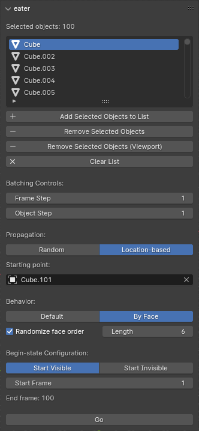
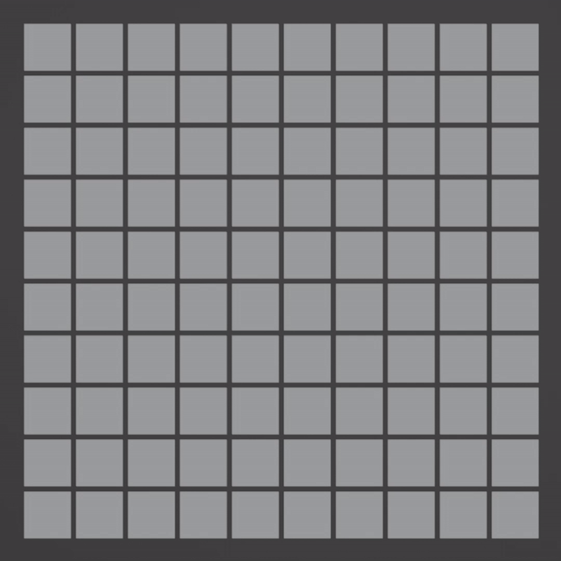
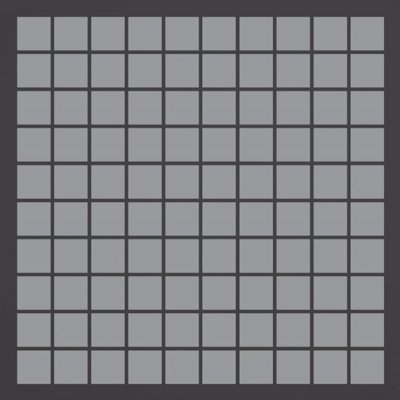
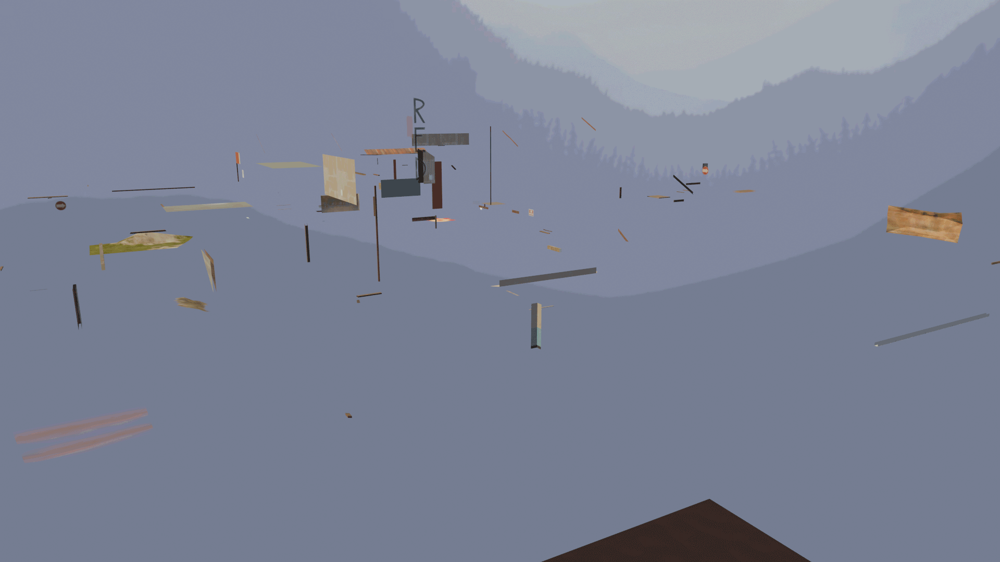

# eater
Eater is a blender addon that automatically creates staggered keyframes for toggling the visibility on groups of objects. It comes with a wide range of customizable parameters to fit whatever effect you're going for.

  

 

## Installation
There are two options:
1. (Recommended) Download the latest release from the release tab, put the zip somewhere you will remember (don't extract). In blender go to Edit->Preferences, install the zip, and save.

2. Download eater.py, open it in the text editor within blender and press the play button at the top bar. Press 'n' in object mode in the main viewport and navigate to the eater tab.

 

## Controls
### Batching Controls
`Frame Step`: Controls the amount of time between objects being processed. By default this is set to 1, meaning objects are toggled on/off every frame.

`Object Step`: Controls how many objects will be keyframed per framestep. For example, if object step is 4, 4 objects will be toggled on/off on the same frame.

### Propagation
`Random` will toggle objects on/off in a random order over time. `Location-based` allows you to select where the first affected object is, and the rest of the effect will spread from that point. `Experimental` uses path finding algorithms to find the shortest path between every object and traverse through them this way. Shown here are the random and location-based modes (in this example Experimental will have the same result as location-based given the starting point is the same):

  

  

### Behavior
`Default` specifies the normal behavior of making an object go from fully visible to invisible (or vice versa).
`By Face` will instead apply the Build modifier to the objects individually.
  - `Randomize face order` selects the randomize option in the build modifier
  - `Length` = how many frames it will take for the object to have all its faces toggled on/off

### Begin-state Configuration
You can choose whether you want objects to gradually appear (`Start Invisible`) or gradually disappear (`Start Visible`) over time. These settings are also automatically applied to the Build modifiers if `By Face` is the selected behavior.
Specify the frame where the effect will start with `Start Frame`. 
> [!WARNING]
> For every selected object, a keyframe will be places at `Start Frame - 1` so make sure that the keyframes created by the addon do not interfere with existing keyframes.

 

## Notes
The experimental mode can be very time consuming and very memory-demanding with many objects selected as it relies on possible millions of edge calculations to construct a minimum spanning tree. Blender may become unresponsive as a result.
The results from the experimental mode are also very unpredictable so try messing with different starting positions to see which one gives you the best effect (if of course the processing time isn't long enough to dissuade you from doing this).

Please feel free to report any issues or suggestions in the issues page!

## Demo

  

Here it is on a TF2 map with >8000 objects. On my machine it took roughly 2 seconds to complete.

